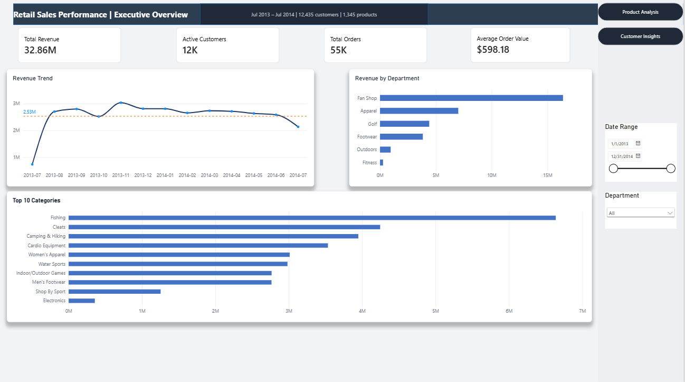
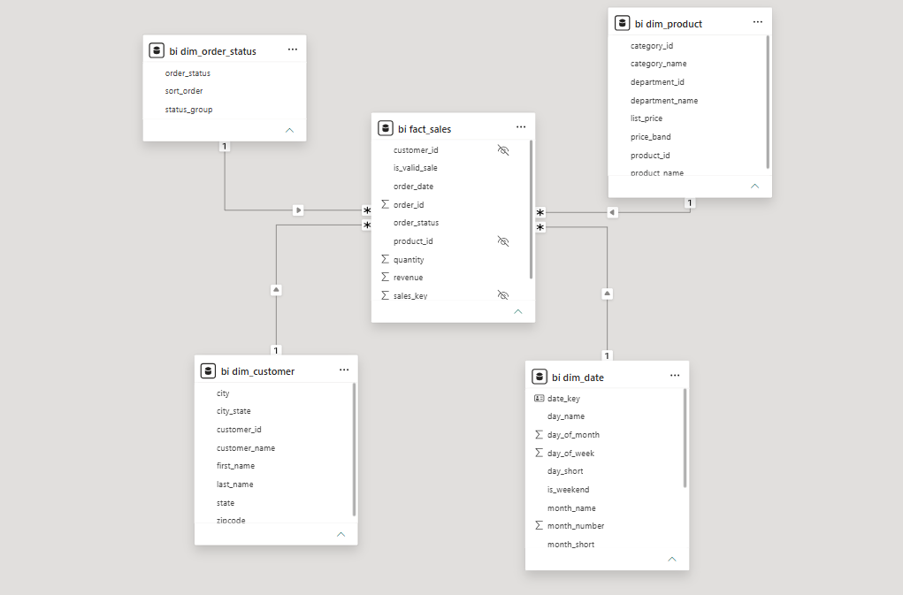
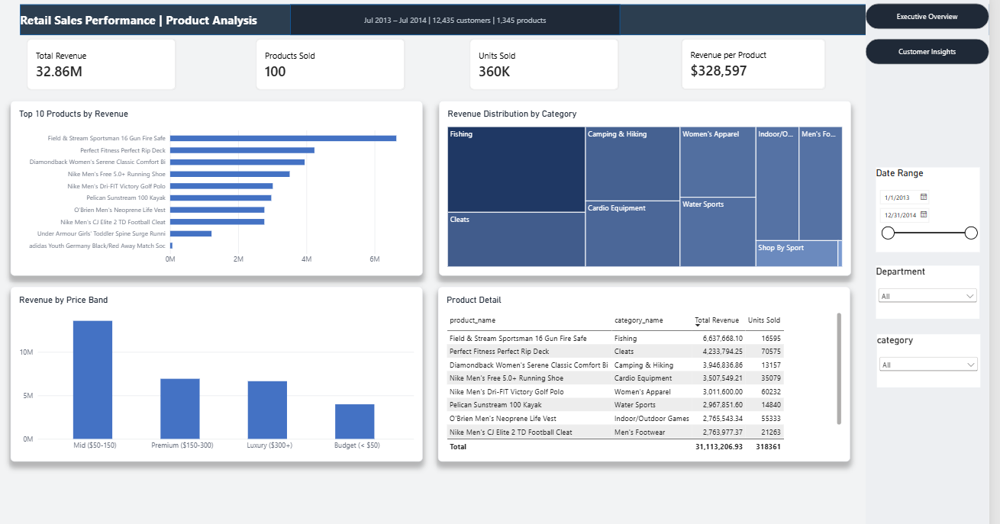
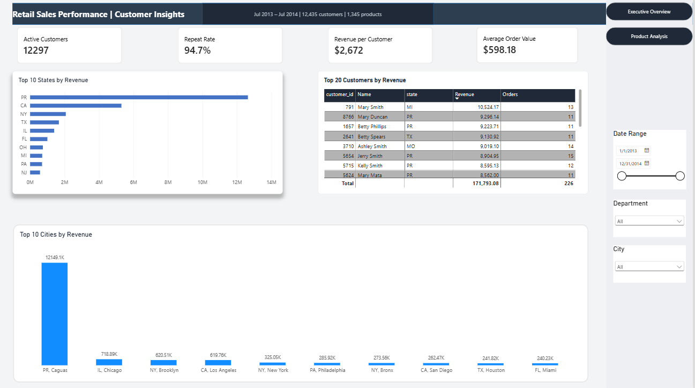

# Retail Sales Analytics — SQL + Power BI

End-to-end analytics project on a retail e-commerce dataset. Business logic and transformation in PostgreSQL, semantic modelling and visualisation in Power BI.

> Before publishing: replace `<your name>`, add your screenshots to `images/`, and add the `.pbix` file to `powerbi/`.



---

## The dataset

| Table | Rows | Description |
|---|---|---|
| `orders` | 68,883 | One row per order, with status and date |
| `order_items` | 172,198 | Order line items — the transaction grain |
| `customers` | 12,435 | Customer master with city and state |
| `products` | 1,345 | Product catalogue with list price |
| `categories` | 58 | Product categories |
| `departments` | 6 | Top-level departments |

Source: itversity retail dataset. PostgreSQL 14, local instance. Coverage: 25 Jul 2013 – 24 Jul 2014.

---

## Business questions

1. How is revenue trending, and is there underlying growth?
2. Which products and categories drive revenue, and how concentrated is it?
3. Which geographic markets are strongest?
4. Who are the highest-value customers, and how many come back?
5. How much of the catalogue actually sells?
6. **Is this data trustworthy enough to act on?**

The sixth question turned out to be the most important one.

---

## Architecture

```
PostgreSQL                                  Power BI
──────────                                  ────────
raw tables (public schema)
    │
    ├── 01_exploration.sql   ←── exploratory analysis, never loaded
    │
    └── 02_views.sql  ──────────────────►   Import ──► Star schema
        (bi schema)                              │
        · bi.dim_date                            ├── DAX measures
        · bi.dim_product                         │
        · bi.dim_customer                        └── 3 report pages
        · bi.dim_order_status
        · bi.fact_sales
```

Business logic lives in SQL views under version control. Power BI imports those views and handles modelling, measures and presentation. This keeps the transformation logic reviewable and reusable rather than locked inside a binary `.pbix` file.

In a governed production environment these view definitions would reach the warehouse through a reviewed pull request (dbt or equivalent) rather than being created directly against production. The `bi` schema here mirrors the analytics-sandbox pattern.



---

## Headline figures

| Metric | Value |
|---|---|
| Revenue | $32.86M |
| Orders | ~55,000 (of 68,883 placed) |
| Active customers | 12,297 (of 12,435 registered) |
| Average order value | $598.18 |
| Units sold | ~360,000 |
| Products that sold | **100** (of 1,345) |

Revenue excludes `CANCELED` and `SUSPECTED_FRAUD` orders via the `is_valid_sale` flag on `bi.fact_sales`.

---

## Key findings

**Revenue is flat, not growing.** Monthly revenue holds near $2.7M, peaking at $3.0M in November 2013 (holiday season) and eroding roughly 13% through mid-2014. There is no underlying growth trend. July 2013 and July 2014 are partial months and must not be read as declines.

**Revenue concentration is extreme, and it is a strategic risk.** Fan Shop alone generates ~$16M — roughly half of all revenue — while Fitness contributes under $1M. Six products produce 74% of revenue and the seventh crosses 80%. Seven SKUs out of a 1,345-product catalogue carry four fifths of the business.

**Volume and revenue point at different products.** The best seller by units (Perfect Fitness Rip Deck, 70,575 units) earns $4.23M. A single high-ticket item, Field & Stream Sportsman 16 Gun Fire Safe, earns $6.64M — 57% more revenue from a quarter of the volume, and 21% of company revenue from one SKU. Ranking by units would have pointed inventory and marketing at the wrong product.

**92.6% of the catalogue is dead.** Only 100 of 1,345 products recorded a single sale across the full year.

**The dataset is synthetic, and geographic and behavioural analysis on it is unreliable.** See below.

---

## Data quality assessment

Five independent checks point to the same conclusion. Each is reproducible from `sql/01_exploration.sql`.

| # | Check | Result | Why it matters |
|---|---|---|---|
| 1 | Catalogue activation | 100 of 1,345 products sold — a round number | Transactions appear distributed across a fixed subset |
| 2 | Geographic concentration | Caguas, PR = $12.1M, 37% of revenue, 17x Chicago | A city of ~100,000 cannot outsell Chicago, LA and NY combined |
| 3 | Customer name uniqueness | "Mary Smith" appears hundreds of times | Names are drawn from a short generated list |
| 4 | Repeat purchase rate | 94.7% | Typical e-commerce sits at 20–40% |
| 5 | Cohort retention | Flat at 33–38% for twelve months | Real cohorts decay steeply and continuously |
| 6 | Weekday distribution | 13.5% spread across all seven days | Real retail peaks at roughly 2x the trough |

**The finding that changed the model.** Customer names are not unique. Grouping revenue by name produced a phantom top customer — "Mary Smith" with 2,797 orders worth $1.68M. Keying on `customer_id` corrected this to $10,524 on 13 orders, a 160x overstatement. Every customer-level query in this project keys on `customer_id`.

**A schema defect handled without dropping data.** 264 products reference `category_id` 59, which does not exist in the `categories` table. An inner join silently reduced the product dimension from 1,345 to 1,081. `bi.dim_product` uses a `LEFT JOIN` with `COALESCE` so catalogue coverage stays accurate. Those products generated zero revenue, so revenue reporting was unaffected — but the count would have been wrong.

**What this means.** Revenue, product and order-status analysis remain internally consistent and are presented as-is. Geographic and customer-behaviour findings are reported with the caveat above rather than presented as business results. A 94.7% repeat rate is not an achievement to celebrate; it is evidence that the underlying behaviour was generated at random.

---

## Report pages

**1. Executive Overview** — Revenue, orders, AOV and active customers as KPI cards. Monthly revenue trend with an average reference line. Revenue by department. Top 10 categories. Date and department slicers.


**2. Product Analysis** — Top 10 products by revenue. Category treemap with a revenue-driven colour gradient. Revenue by price band. Product detail table showing the revenue/volume divergence.



**3. Customer Insights** — Top 10 states and top 10 cities by revenue. Top 20 customers keyed on `customer_id`. Repeat rate and revenue per customer.

---

## SQL techniques demonstrated

- Common Table Expressions, including chained multi-step CTEs
- Window functions: `RANK`, `ROW_NUMBER`, `NTILE`, `LAG`, `FIRST_VALUE`, running totals
- `SUM(SUM(x)) OVER ()` for percentage-of-total inside a grouped query
- `FILTER` clause for conditional aggregation
- Self-joins for market-basket pair analysis
- `GENERATE_SERIES` to build a date dimension
- Anti-joins to find orphan records and dead stock
- RFM segmentation and monthly cohort retention
- Explicit numeric casting — `order_item_subtotal` is `double precision`, so any derived expression must be cast to `numeric` *after* the arithmetic, before `ROUND`

---

## Repository structure

```
retail-analytics/
├── README.md
├── sql/
│   ├── 01_exploration.sql     # Analysis with findings documented inline
│   └── 02_views.sql           # Star schema semantic layer
├── powerbi/
│   ├── retail_dashboard.pbix
│   └── dax_measures.md        # Every measure, documented
└── images/
```

---

## How to reproduce

```bash
# 1. Restore the database, then create the semantic layer
psql -U postgres -d itversity_retail_db -f sql/02_views.sql

# 2. Verify
#    SELECT COUNT(*) FROM bi.fact_sales;    -- 172,198
#    SELECT COUNT(*) FROM bi.dim_product;   -- 1,345
```

Then open `powerbi/retail_dashboard.pbix` and connect with:

- **Server:** `localhost:5432`
- **Database:** `itversity_retail_db`
- **Connectivity:** Import
- Leave the SQL statement box empty — select the `bi` schema views in the Navigator

`02_views.sql` requires `CREATE` permission. If you only have read access, import the raw tables and replicate the joins in Power Query instead.

---

## Tools

PostgreSQL 14 · pgAdmin 4 · Power BI Desktop · DAX · Power Query
